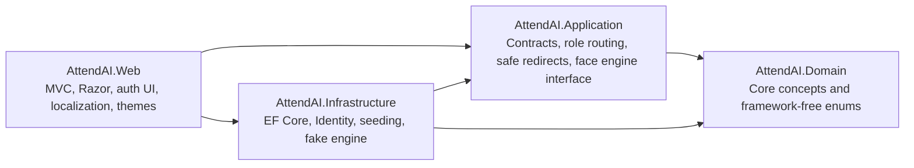
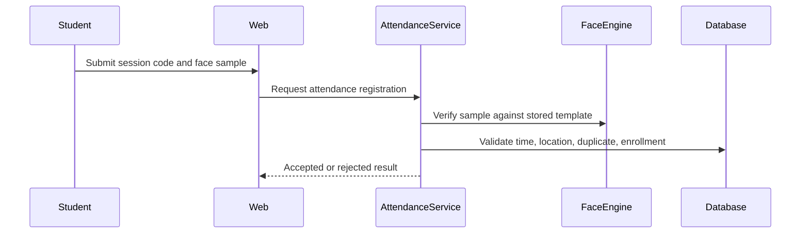

# 02. System Architecture

## Layer Responsibilities

## Project References

- Domain references no project.
- Application references Domain.
- Infrastructure references Application and Domain.
- Web references Application, Infrastructure, and Domain.
- Tests reference the needed production projects.

## Authentication Design

ASP.NET Core Identity stores users and roles in SQL Server through `ApplicationDbContext`. Cookies use `__Host-AttendAI.Auth`, Secure, HTTP-only, SameSite Lax, and sliding expiration. Login validates disabled accounts and safe return URLs. Logout and culture switching are protected by antiforgery tokens.

## Authorization Design

Role names live in `RoleConstants`. `DashboardRouteService` maps roles to dashboards. Dashboard actions use `[Authorize(Roles = ...)]` so cross-role access is denied by policy enforcement.

## Localization Design

Resources live under `src/AttendAI.Web/Resources`. Supported cultures are `en-US` and `ar-JO`. The active culture is selected by the ASP.NET Core culture cookie and the layout applies `lang` and `dir` from `CultureInfo.CurrentUICulture`.

## Theme Design

CSS custom properties define design tokens. `[data-theme="dark"]` overrides tokens. JavaScript stores `attendai-theme` in localStorage and applies the selected or system theme before styles load.

## Face Engine Abstraction

`IFaceRecognitionEngine` lives in Application. Infrastructure provides `FakeFaceRecognitionEngine` for tests and development. Controllers and Razor views do not contain face-recognition logic.

## Future Attendance Workflow

This workflow is documented for future sprints only.

## Error Handling And Logging

Development uses the developer exception page. Non-development uses `/Home/Error` and status-code re-execution. Error pages display a trace identifier. Built-in logging is used; sensitive values, passwords, raw images, and templates must not be logged.

## Configuration Strategy

Configuration supports `ConnectionStrings:DefaultConnection`, `FaceRecognition`, `SupportedCultures`, and optional `DemoAdmin`. Secrets belong in User Secrets or environment variables.

## Security Boundaries

- Domain and Application contain no web or EF implementation details.
- Web validates return URLs before local redirects.
- Infrastructure owns persistence and external adapters.
- Biometric templates must not be exposed through MVC models.
