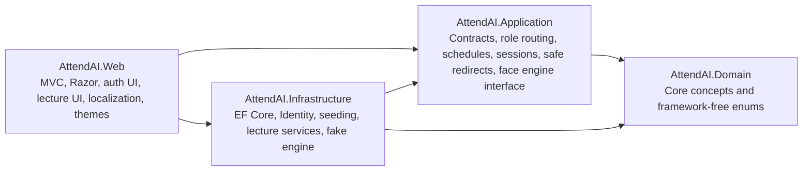
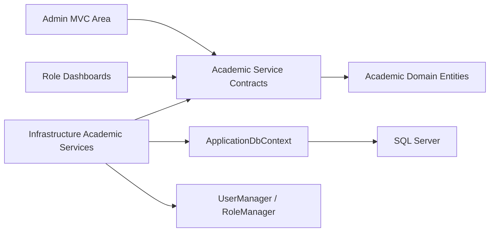
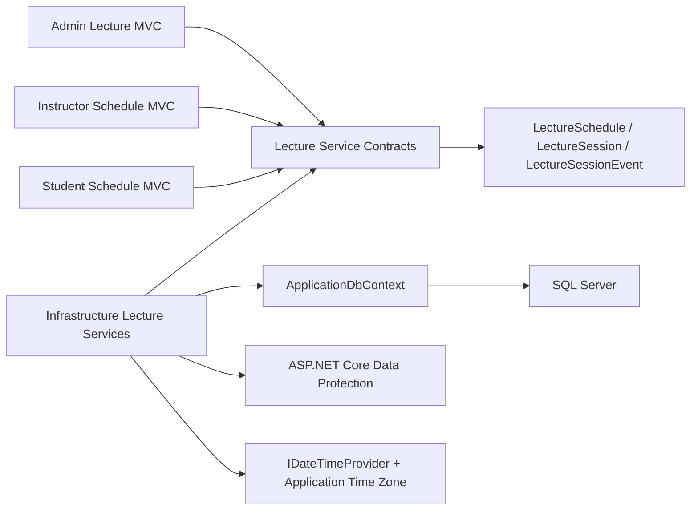
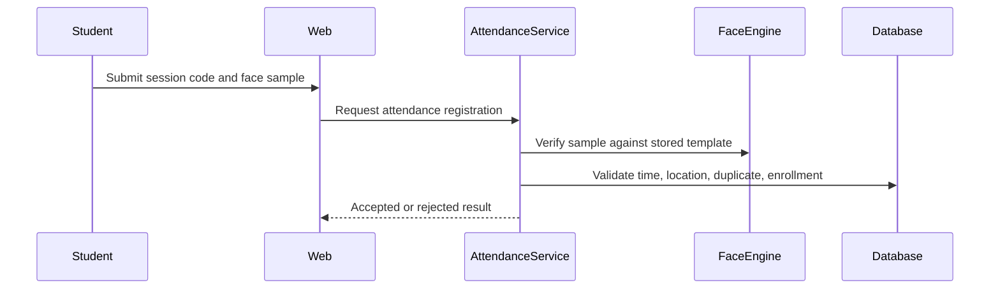

# 02. System Architecture

## Layer Responsibilities

## Project References

- Domain references no project.
- Application references Domain.
- Infrastructure references Application and Domain.
- Web references Application, Infrastructure, and Domain.
- Tests reference the needed production projects.

## Authentication Design

ASP.NET Core Identity stores users and roles in SQL Server through `ApplicationDbContext`. Cookies use `__Host-AttendAI.Auth`, Secure, HTTP-only, SameSite Lax, and sliding expiration. Login validates disabled/inactive accounts and safe return URLs. Logout and culture switching are protected by antiforgery tokens. Sprint 2 adds `IsActive`, `MustChangePassword`, and `UpdatedAtUtc` to `ApplicationUser` so administrator-created accounts can require a first-login password change.

## Authorization Design

Role names live in `RoleConstants`. `DashboardRouteService` maps roles to dashboards. Dashboard actions use `[Authorize(Roles = ...)]` so cross-role access is denied by policy enforcement.

Admin academic management controllers live under `Areas/Admin` and inherit `[Area("Admin")]`, `[Authorize(Roles = RoleConstants.Admin)]`, and `[AutoValidateAntiforgeryToken]` from `AdminControllerBase`.

## Academic Management Design

Academic entities live in Domain and remain framework-independent. Application exposes commands, DTOs, paged queries, lookup contracts, and service interfaces. Infrastructure implements those contracts with EF Core and ASP.NET Core Identity transactions where account creation or password reset must stay consistent with academic profiles.

Activation/deactivation preserves historical rows. SQL Server indexes and service rules enforce unique department/course/classroom codes, unique Student and Instructor profile links to Identity users, unique enrollments, capacity checks, and one active primary instructor per section.

## Lecture Scheduling And Session Design

Lecture scheduling follows the same layered style as Sprint 2. Domain owns state and validation concepts. Application owns commands, queries, DTOs, result models, and service interfaces. Infrastructure owns EF Core, SQL Server transactions, schedule conflict queries, code generation/hash/protection, lifecycle events, and time-zone conversion. Web controllers remain thin MVC use-case adapters.

Schedule conflict checks protect Classroom, Instructor, and Section resources using active effective-date overlap plus time-window overlap. Service methods use transactions because recurring interval exclusion cannot be fully expressed as a simple SQL Server unique constraint.

Session lifecycle methods snapshot schedule/resource values, persist UTC timestamps, generate a temporary session code, store only hash/protected code state, and append audit events. Student projections deliberately omit plain code, protected code, and hash fields.

## Localization Design

Resources live under `src/AttendAI.Web/Resources`. Supported cultures are `en-US` and `ar-JO`. The active culture is selected by the ASP.NET Core culture cookie and the layout applies `lang` and `dir` from `CultureInfo.CurrentUICulture`.

## Theme Design

CSS custom properties define design tokens. `[data-theme="dark"]` overrides tokens. JavaScript stores `attendai-theme` in localStorage and applies the selected or system theme before styles load.

## Face Engine Abstraction

`IFaceRecognitionEngine` lives in Application. Infrastructure provides `FakeFaceRecognitionEngine` for tests and development. Controllers and Razor views do not contain face-recognition logic. Sprint 3 does not call face recognition from lecture scheduling or session management.

## Future Attendance Workflow

This workflow is documented for future sprints only.

## Error Handling And Logging

Development uses the developer exception page. Non-development uses `/Home/Error` and status-code re-execution. Error pages display a trace identifier. Built-in logging is used; sensitive values, passwords, raw images, and templates must not be logged.

## Configuration Strategy

Configuration supports `ConnectionStrings:DefaultConnection`, `FaceRecognition`, `SupportedCultures`, `LectureScheduling`, and optional `DemoAdmin`. Secrets belong in User Secrets or environment variables.

## Security Boundaries

- Domain and Application contain no web or EF implementation details.
- Web validates return URLs before local redirects.
- Infrastructure owns persistence and external adapters.
- Biometric templates must not be exposed through MVC models.
- Temporary session codes must not be stored or logged in plain text.
- Student lecture/session projections must not expose code material.
