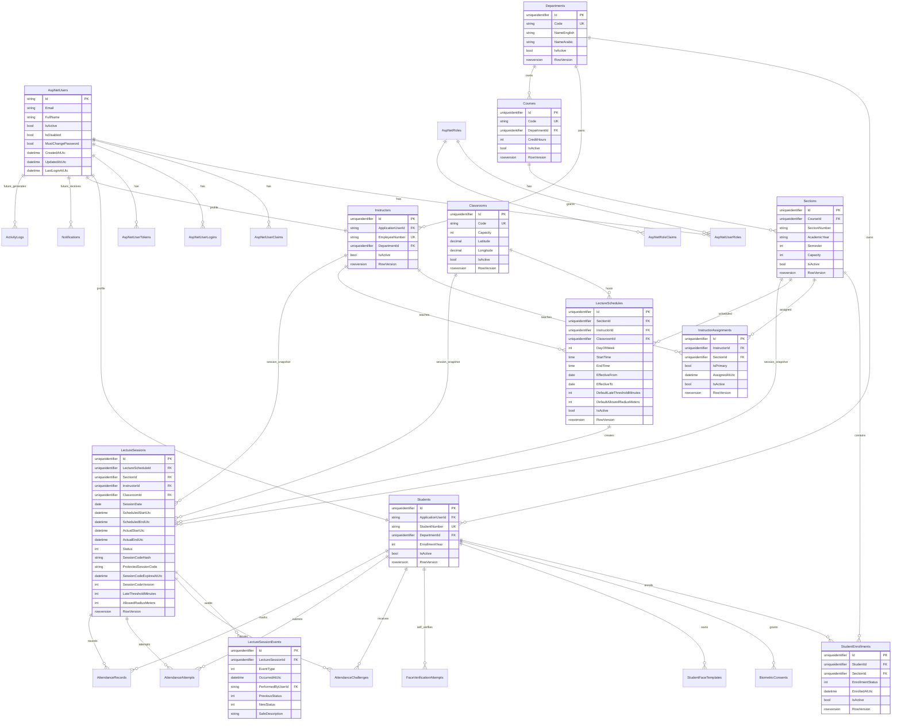
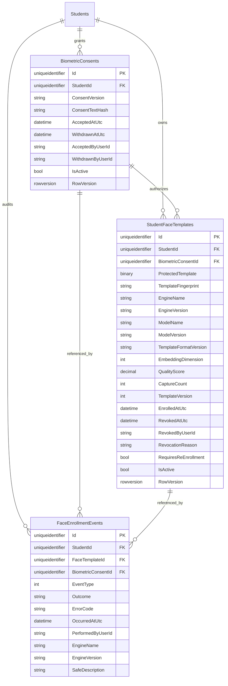
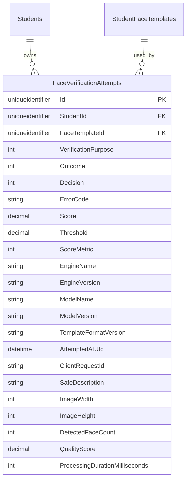
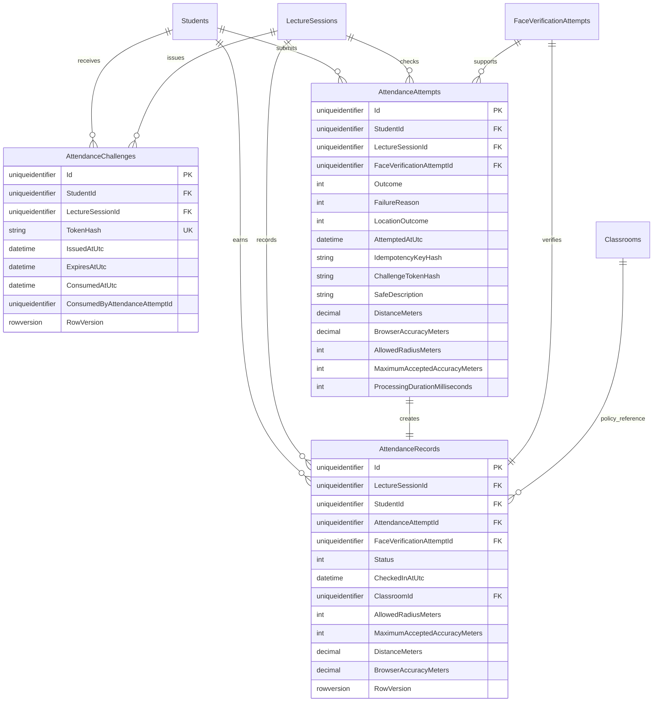

# 03. Database ERD

AttendAI implements ASP.NET Core Identity tables, academic setup tables, lecture schedules, lecture sessions, session lifecycle events, biometric consent/templates/events, Sprint 5 safe face-verification attempts, and Sprint 6 attendance challenges/attempts/records. Sprint 7 reports are projections over those existing tables and do not add report tables. Notifications, one-to-many recognition, and activity logs remain future entities.

Future notification/activity-log entities retain `future_` relationship labels and must not be treated as implemented tables. Sprint 7 reporting is implemented without a persisted reporting entity.

## Sprint 4 Biometric Enrollment ERD Delta

SQL Server constraints include one active consent per Student, one active template per Student, unique template version per Student, rowversion concurrency for consent/template rows, and check constraints for quality score, capture count, embedding dimension, and template version. No raw-image column exists.

## Sprint 5 Face Verification ERD Delta

SQL Server constraints include two foreign keys, seven check constraints for bounded enum/score/image/face-count/timing metadata, indexes for Student/time and outcome/time queries, and a filtered unique idempotency index on `(StudentId, ClientRequestId)` when `ClientRequestId` is not empty.

The table intentionally has no raw image, image path, base64 image, encoding, embedding, protected template, template fingerprint, facial landmarks, session code, attendance status, location, model path, or raw exception column.

## Sprint 6 Attendance ERD Delta

SQL Server constraints include unique attendance record per `(LectureSessionId, StudentId)`, unique challenge token hash, unique attempt idempotency hash per Student/session, unique successful attendance attempt/face attempt links, foreign keys, rowversion concurrency on challenge/record rows, and nonnegative location metadata checks.

Attendance tables intentionally have no raw image, image path, base64 image, encoding, embedding, protected template, template fingerprint, exact submitted Student latitude/longitude, plain challenge token, plain idempotency key, report/export payload, device fingerprint, or raw exception column.

## Sprint 7 Reporting ERD Decision

Sprint 7 did not add tables, columns, foreign keys, indexes, report snapshots, export storage, or persisted absence rows.

Reporting queries derive rows from:

- Active `StudentEnrollments`.
- Completed attendance-enabled `LectureSessions`.
- Successful `AttendanceRecords`.
- Safe `AttendanceAttempts`.
- Safe `LectureSessionEvents`.
- Safe `FaceVerificationAttempts`.
- Safe `FaceEnrollmentEvents`.

The derived `Missed` reporting state is not stored in SQL Server. CSV exports are generated in memory from authorized report DTOs and are not represented in the ERD.
