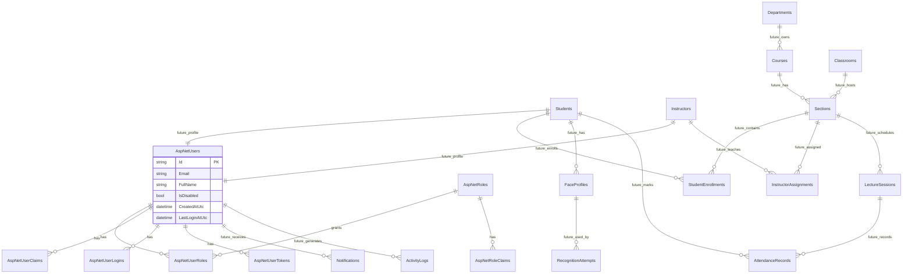

# 03. Database ERD

Sprint 1 implements ASP.NET Core Identity tables and `ApplicationUser` extensions only. Planned academic and attendance tables are included for architectural direction and are not implemented in code during Sprint 1.

Future entities are marked with `future_` relationship labels and must not be treated as implemented Sprint 1 tables.
