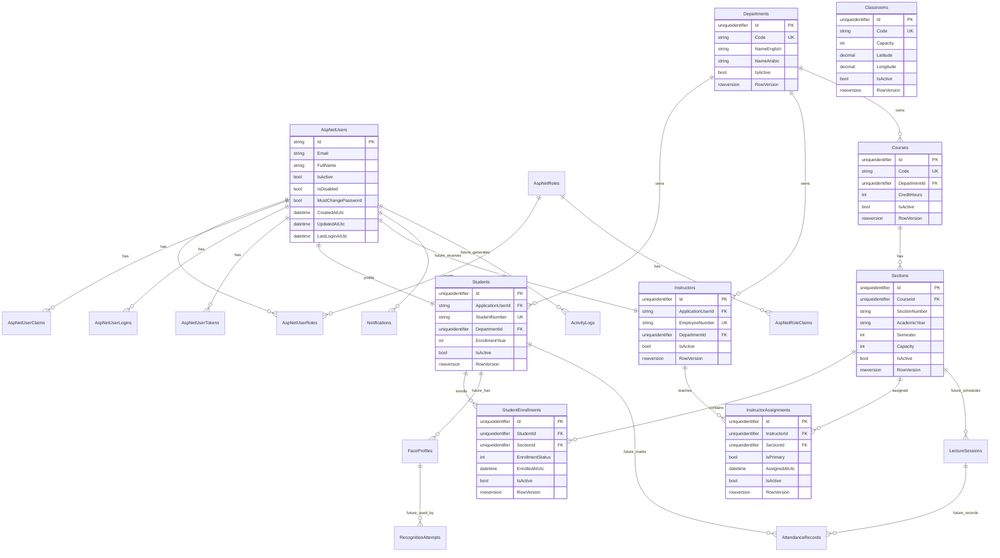

# 03. Database ERD

Sprint 2 implements ASP.NET Core Identity tables plus academic setup tables. Attendance, biometric templates, recognition attempts, notifications, and activity logs remain future entities.

Future entities retain `future_` relationship labels and must not be treated as implemented Sprint 2 tables.
