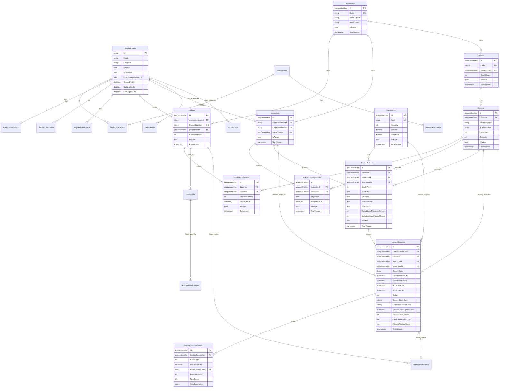
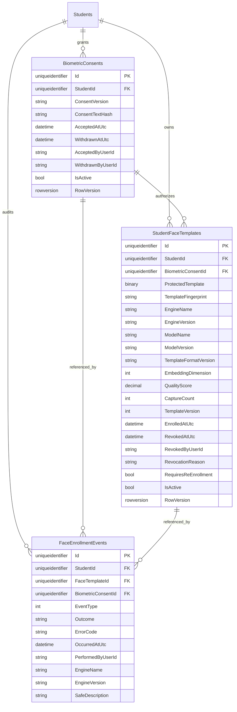

# 03. Database ERD

Sprint 3 implements ASP.NET Core Identity tables, academic setup tables, lecture schedules, lecture sessions, and session lifecycle events. Attendance records, biometric templates, recognition attempts, notifications, and activity logs remain future entities.

Future attendance/reporting entities retain `future_` relationship labels and must not be treated as implemented tables.

## Sprint 4 Biometric Enrollment ERD Delta

SQL Server constraints include one active consent per Student, one active template per Student, unique template version per Student, rowversion concurrency for consent/template rows, and check constraints for quality score, capture count, embedding dimension, and template version. No raw-image column exists.
