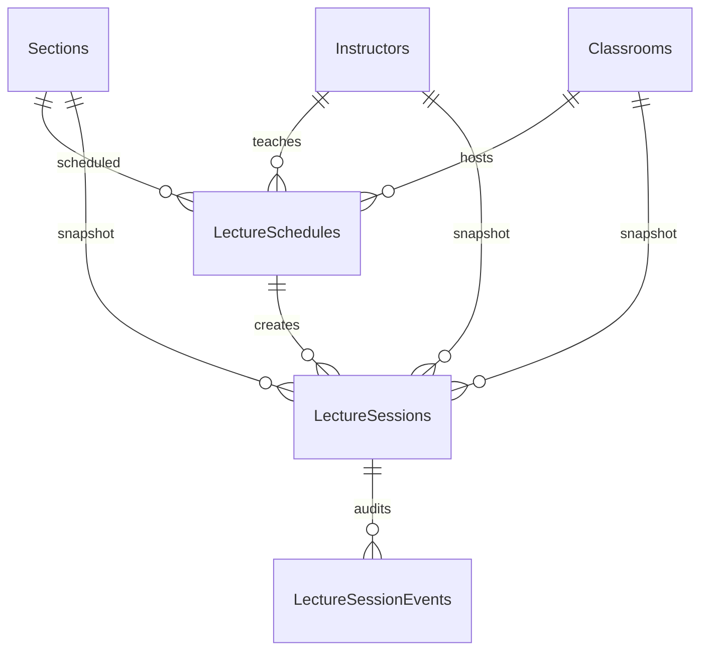
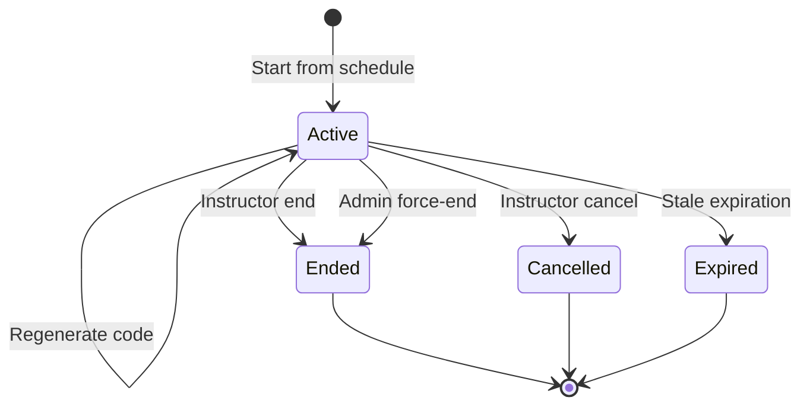

# 18. Lecture Scheduling Domain Model

## Implemented Entities

`LectureSchedule` represents a weekly academic timetable entry for one active Section, assigned Instructor, and Classroom. It stores local recurring day/time values, effective date range, default late threshold, default allowed radius, activation state, audit fields, and row version.

`LectureSession` represents one concrete occurrence of a schedule on a specific date. It snapshots Section, Instructor, Classroom, scheduled UTC times, thresholds, radius, start/end users, status, code hash/protected code state, expiration, and row version.

`LectureSessionEvent` is append-only lifecycle audit history. It stores event type, occurrence time, user, previous status, new status, and a safe non-sensitive description.

## Relationships



## State Transitions



Terminal sessions cannot become active again. Ending, cancelling, force-ending, and expiring a session invalidate its code.

## Conflict Rules

Two schedule windows overlap when:

```text
ExistingStart < NewEnd
AND
NewStart < ExistingEnd
```

Recurring conflicts are checked only for active schedules with overlapping effective ranges, matching day-of-week, overlapping times, and a shared protected resource:

- Same Classroom.
- Same Instructor.
- Same Section.

Edits exclude the current schedule. SQL Server indexes support bounded conflict queries, while the service performs overlap validation inside transactions because SQL Server cannot express recurring interval exclusion constraints directly.

## Time-Zone Strategy

- Application time zone defaults to `Asia/Amman`.
- Windows fallback is `Jordan Standard Time`.
- Recurring schedule start/end are stored as local academic `TimeOnly` values.
- Session timestamps are stored as UTC `DateTimeOffset`.
- Views display session times in the configured application time zone.
- Business services use `IDateTimeProvider` and `IApplicationTimeZoneService`; client countdowns are display-only.

## Session Snapshot Strategy

`LectureSession` stores Section, Instructor, Classroom, scheduled start/end, late threshold, and radius as historical values. Viewing session history does not depend only on mutable schedule defaults.

## Role Boundaries

- Admin manages schedules and can monitor or force-end sessions.
- Instructor can only view/start/manage sessions for assigned schedules.
- Student can only view schedules and active-session indicators for actively enrolled Sections.
- Student responses do not include plain code, protected code, or code hash fields.

## Future Attendance Engine Integration

Sprint 3 prepares schedule/session identifiers, timing windows, late thresholds, radius settings, and active-session state for Sprint 4. It does not validate submitted codes, mark attendance, calculate distance, store attendance records, or invoke face recognition.
