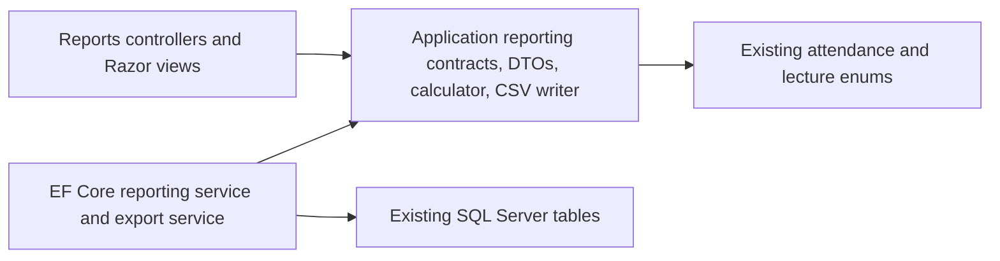

# 48. Reporting And Analytics Architecture

## Overview

Sprint 7 adds role-scoped reporting and analytics as projections over the existing academic, lecture, biometric, and attendance tables. It does not add persisted report entities, report snapshots, or absence rows.

## Layer Placement

Domain remains unchanged. Reporting semantics live in Application contracts and calculator helpers. Infrastructure owns EF Core projections and export generation. Web owns authorization attributes, localized views, filter binding, and no-store download responses.

## Application Contracts

Implemented under `src/AttendAI.Application/Reporting`:

- `AttendanceReportFilter`
- `AttendanceAuditFilter`
- `AttendanceReportStatus`
- `AttendanceReportSort`
- `AuditEventCategory`
- `AttendanceReportSummaryDto`
- `AttendanceReportRowDto`
- `StudentAttendanceReportDto`
- `InstructorAttendanceReportDto`
- `AdminAttendanceReportDto`
- `AttendanceAuditEventDto`
- `ReportFileExportDto`
- `IAttendanceReportingService`
- `IAttendanceReportExportService`
- `SafeCsvReportWriter`
- `AttendanceReportCalculator`

## Reporting Sources

Sprint 7 reads these existing tables:

- `StudentEnrollments`
- `LectureSessions`
- `AttendanceRecords`
- `AttendanceAttempts`
- `LectureSessionEvents`
- `FaceVerificationAttempts`
- `FaceEnrollmentEvents`

## Reporting Semantics

- Eligible sessions are completed attendance-enabled sessions.
- Cancelled sessions are excluded.
- Future sessions are excluded.
- Attendance-disabled sessions are excluded.
- Active enrollments only are included.
- Inactive Students, Sections, and Courses are excluded.
- `Present` and `Late` come from persisted `AttendanceRecord.Status`.
- `Missed` is derived when an eligible enrolled Student has no attendance record for the session.
- Attendance percentage is `(Present + Late) / EligibleSessions * 100`, rounded to two decimals away from zero.

## Role Scope

- Student reports force `StudentId` from the authenticated Student profile.
- Instructor reports force `InstructorId` from the authenticated Instructor profile.
- Admin reports allow filterable cross-section review.

The browser does not provide trusted Student ownership for Student reports or Instructor ownership for Instructor reports.

## Audit Sources

Admin audit search reads safe metadata from existing event and attempt tables:

- `LectureSessionEvents`
- `AttendanceAttempts`
- `FaceVerificationAttempts`
- `FaceEnrollmentEvents`

Audit search excludes protected templates, raw captures, template fingerprints, token hashes, idempotency hashes, exact submitted coordinates, model paths, and native exception details.

## Migration Decision

No Sprint 7 migration was created. The feature is query-only plus in-memory export over existing Sprint 2-6 schema.

## Performance Decisions

Filtering and pagination are applied in the reporting service before the result page is materialized. Export is capped by the service limit and generated in memory without writing temporary files to disk.

